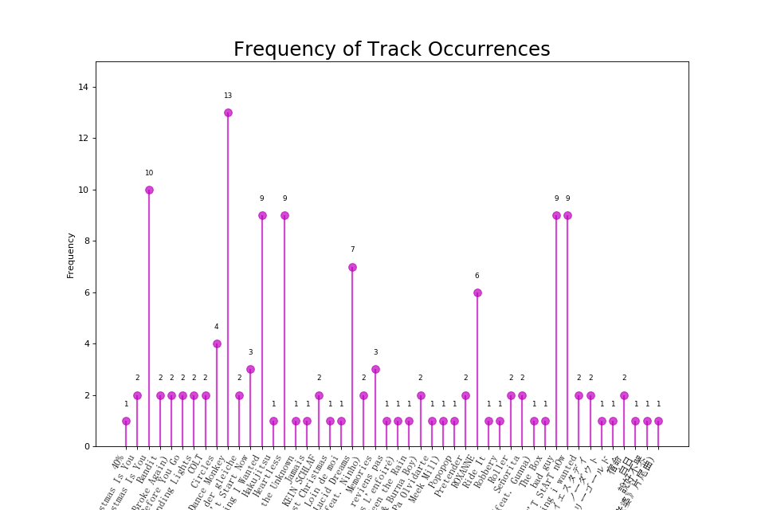
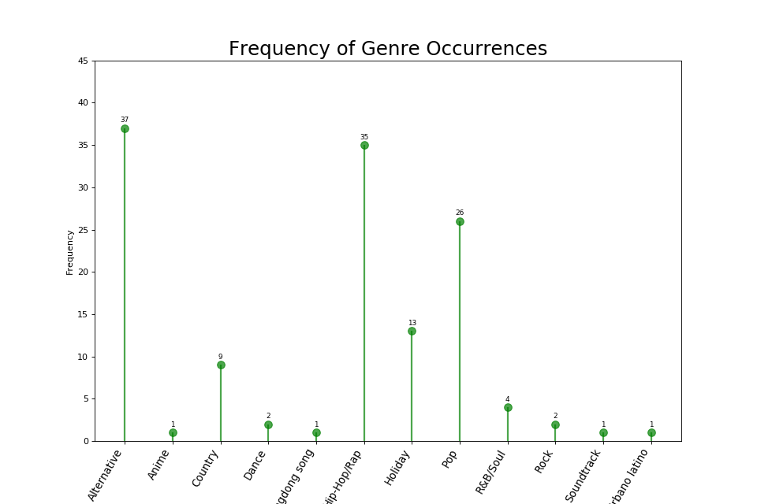
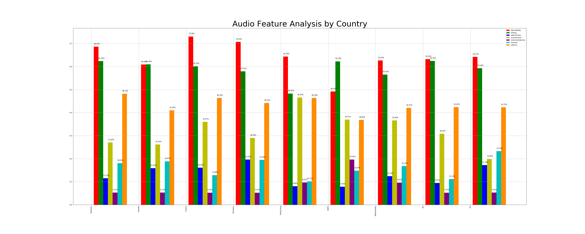
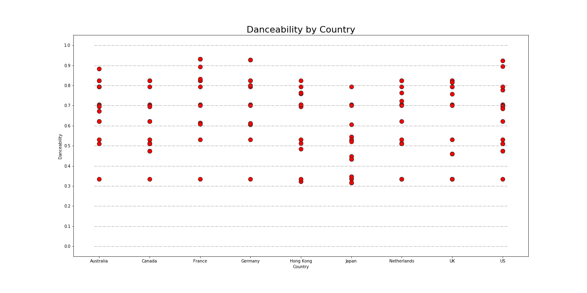
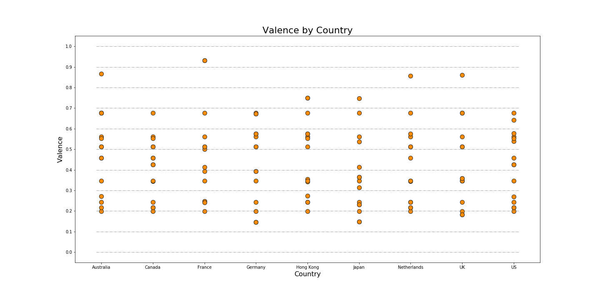

# Analysis Between Streaming Platforms - Apple Music, Spotify, LastFM

## Project Proposal 

As a year comes to an end, Spotify releases their annual End-of-the-Year breakdown of each user's top charts of the year. Our group was inspired by this product to create a similar analysis, utilizing Apple Music, Spotify, and LastFM API calls to generate current data. Rather than observing an individual's top streaming activity, we decided to dissect through the top charting tracks through an array of countries for comparison. 

We didn't have explicit questions we wanted answered through our research. We were interested in seeing how varied the different platforms really were, if they were at all. Using Spotify's Audio Features, we also wanted to see if those were contributions of why a track was a big hit and how could future artists use that to get their music charting on national levels. Our main interested boiled down to 'Analysis By':

* Genre
* Artist
* Track Name
* Country
* Audio Features

## Finding Data

We called in data from [iTunes](https://affiliate.itunes.apple.com/resources/documentation/itunes-store-web-service-search-api/), [LastFM](https://www.last.fm/api/), and [Spotify](https://developer.spotify.com/documentation/web-api/). 

We initially were set on using Apple Music, Spotify, and LastFM as our main sources for API calls. However, once we started creating our Jupyter Notebook for data mining and cleaning, we noticed that Apple Music was not free for developers like Spotify and LastFM were. We chose to use an iTunes RSS link formatted in JSON to retreive the necessary songs per chart. 

We restricted our data analysis across 9 countries: 

* Hong Kong
* Netherlands
* Australia
* Canada
* France
* Japan
* UK
* Germany
* US

These countries are the top regions that use all three streaming platforms. 

## Data Cleanup

We started off creating 3 seperate files that took in the request call and outputted a response. For iTunes and LastFM we did not need to create tokens to authorize these calls, but for Spotify we each created a token that contained our Client Key and Client Secret. With the responses generated, we created a dataframe that pulled the Top 5 songs from each region and their attributes, namely: Album, Artist, and Genre. 

After creating each dataframe, we merged them to pull in the playlist ID tag. This tag would allow us to find the Audio Features of each track. Audio features are listed by type as such:

* **Danceability** describes how suitable a track is for dancing based on a combination of musical elements including tempo, rhythm stability, beat strength, and overall regularity. A value of 0.0 is least # danceable and 1.0 is most danceable.

* **Energy** is a measure from 0.0 to 1.0 and represents a perceptual measure of intensity and activity. Typically, energetic tracks feel fast, loud, and noisy. For example, death metal has high energy, while a Bach prelude scores low on the scale. Perceptual features contributing to this attribute include dynamic range, perceived loudness, timbre, onset rate, and general entropy.

* **Pitch Class** = Tonal counterparts: 0=C 1=C♯ 2=D 3=D♯ 4=E 5=F 6=F♯ 7=G 8=G♯ 9=A 10=t or Aor A♯ 11=e or B

* **Loudness** - The overall loudness of a track in decibels (dB). Loudness values are averaged across the entire track and are useful for comparing relative loudness of tracks. Loudness is the quality of a sound that is the primary psychological correlate of physical strength (amplitude). Values typical range between -60 and 0 db.

* **Speechiness** detects the presence of spoken words in a track. The more exclusively speech-like the recording (e.g. talk show, audio book, poetry), the closer to 1.0 the attribute value. Values above 0.66 describe tracks that are probably made entirely of spoken words. Values between 0.33 and 0.66 describe tracks that may contain both music and speech, either in sections or layered, including such cases as rap music. Values below 0.33 most likely represent music and other non-speech-like tracks.

* **Accousticness** - a confidence measure from 0.0 to 1.0 of whether the track is acoustic. 1.0 represents high confidence the track is acoustic.

* **Instrumentalness** - Predicts whether a track contains no vocals. “Ooh” and “aah” sounds are treated as instrumental in this context. Rap or spoken word tracks are clearly “vocal”. The closer the instrumentalness value is to 1.0, the greater likelihood the track contains no vocal content. Values above 0.5 are intended to represent instrumental tracks, but confidence is higher as the value approaches 1.0.

* **Liveness** - Detects the presence of an audience in the recording. Higher liveness values represent an increased probability that the track was performed live. A value above 0.8 provides strong likelihood that the track is live.

* **Valence** - A measure from 0.0 to 1.0 describing the musical positiveness conveyed by a track. Tracks with high valence sound more positive (e.g. happy, cheerful, euphoric), while tracks with low valence sound more negative (e.g. sad, depressed, angry).

## Data Analysis

### Frequency of Track Occurrances 

  

This charts the amount of times appeared as a Top 5 chart across our arrays of countries and streaming platforms. Dance Monkey by Tones and I was featured the most amount of times, appearing 13 times. 

### Frequency of Artist Occurrances

  

The artist that was featured the most amongst the Top 5 chart was Billie Eilish, with a frequency of 20. Although she did not appear as the top track occurrance, this could lead to conclude that Billie has multiple songs that made it to the Top 5 charts. 

### Frequency of Genre Occurrances

  

Alternative and Hip-Hop/Rap were the top charting genres across the 9 countries we analyzed. This gives us insight on what the current trend in music as we near the end of the decade. 

### Audio Feature Analysis by Genre

  

This diagram represents the different audio features grouped by the different genres. Each genre had a varied analysis. For instance, Alternative and Pop music have a higher danceability, but Dance music has a higher valence. From this, we can infer that Dance music makes people significantly happier, but Alternative and Pop music don't have to necessarily produce happy songs that make them danceable. 

### Audio Feature Analysis by Country

  

This diagram represents the different audio features grouped by the different countries. Similarly, this graph has a varied analysis. By looking at this chart, we can tell the France perfers music that is danceable over instrumentalness. Alternative and Pop music would chart well in France. 

From this chart, we decided we'd like to take a closer look at danceability, energy, and valence by country. 

#### Danceability by Country 

  

This scatter plot shows that France, Germany, and the US favor danceability in their songs, with many of their top 5 tracks ranking in a close value of danceability per country.

#### Energy by Country 

  

This plot shows that Japan enjoys energetic songs, with France coming in a close second.

#### Valence by Country 

  

The chart shows that France prefers their music to be happier, having a higher valence. Alternatively, Germany and the UK have sadder and angrier music that make it to their top charts. 

